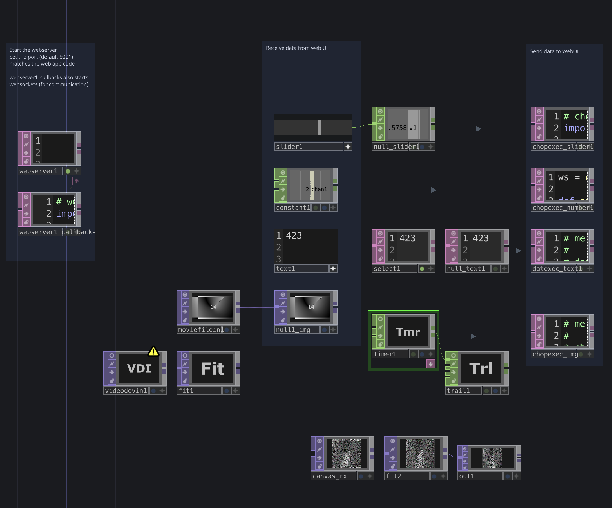

# TouchDesigner ↔ WebSocket ↔ p5.js — 2‑Way Control & Image Streaming

This guide walks you through setting up a **single .toe** project that:

* Serves an HTML interface (slider, number, text box + a p5.js canvas) from TouchDesigner’s **Web Server DAT**.  
* Sends UI data **browser → TD** and echoes updates **TD → all browsers** via WebSockets.  
* Streams any TOP from TD to the browser as JPEG frames.  
* Sends the *rendered* p5 canvas back to TD as a live TOP.

Tested on **TD 2023.x** and any modern Chromium/Firefox/Safari browser on the same LAN.

---

## 1  Network overview



> *Feel free to rearrange nodes—the names just have to match the code.*

---

## 2  Create the core operators (inside `/project1`)  

| Operator | Rename to | Notes |
|----------|-----------|-------|
| **Web Server DAT** | `webserver1` | Port `5001`, Callbacks `webserver1_callbacks` |
| **Text DAT** | `webserver1_callbacks` | Paste the Python from § 3 |
| **Slider COMP** | `slider1` | Output to `null_slider1` |
| **Constant CHOP** | `constant1` | Output to `null_number1` |
| **Text DAT** | `text1` | Output to `null_text1` |
| **Script TOP** | `canvas_rx` | *Leave Callbacks blank* |
| **Movie File In TOP** | `moviefilein1` | Any image/video you want to push |
| **Timer CHOP** | `timer1` | 0.2 s length, one shot, Repeat On |
| **CHOP Exec** | `chopexec_img` | Attached to `timer1` |

Add CHOP/DAT Execs for slider/number/text that simply call
`ws._broadcast(...)` (see § 3).

---

## 3  Paste this into `webserver1_callbacks`  

```python
# webserver1_callbacks.py
import os, urllib.parse, mimetypes, json, base64
mimetypes.init()

def _mime(p): return mimetypes.guess_type(p)[0] or 'text/plain'

def _broadcast(dat, sender, payload):
    txt = json.dumps(payload, ensure_ascii=False)
    for c in clients:
        if c != sender:
            dat.webSocketSendText(c, txt)

def send_top(dat, top):
    jpg = top.saveByteArray('.jpg', quality=85)
    b64 = base64.b64encode(jpg).decode('ascii')
    _broadcast(dat, None, {"type":"image","mime":"image/jpeg","data":b64})
# ---------------------------------------------------------
DISK_ROOT = project.folder + '/webui'
DAT_MAP   = { '/index.html': op('index') }

def onHTTPRequest(dat, req, res):
    url = urllib.parse.urlparse(req['uri']).path or '/'
    if url == '/': url = '/index.html'
    fs  = os.path.normpath(os.path.join(DISK_ROOT, url.lstrip('/')))
    if fs.startswith(DISK_ROOT) and os.path.isfile(fs):
        res.update(statusCode=200,statusReason='OK',
                   **{'Content-Type':_mime(fs)},data=open(fs,'rb').read()); return res
    td = DAT_MAP.get(url)
    if td:
        res.update(statusCode=200,statusReason='OK',
                   **{'Content-Type':_mime(url)},data=td.text.encode()); return res
    res.update(statusCode=404,statusReason='Not Found',data=b'404'); return res
# ---------------------------------------------------------
clients=set()

def onWebSocketOpen(dat, client, uri):
    op('canvas_rx').par.Lock = True      # lock once for session
    clients.add(client)
    dat.webSocketSendText(client,json.dumps({"type":"connection","status":"ok"}))

def onWebSocketClose(dat, client, *a): clients.discard(client)

def onWebSocketReceiveText(dat, client, txt):
    try: msg=json.loads(txt)
    except: return
    typ,val = msg.get('type'), msg.get('value')
    if   typ=='slider':   op('slider1').par.value0  = float(val)
    elif typ=='number':   op('constant1').par.value0= float(val)
    elif typ=='text':     op('text1').text          = str(val)
    elif typ=='image':                               # browser → TD
        op('canvas_rx').loadByteArray('.jpg', base64.b64decode(msg['data']))
    _broadcast(dat, client, msg)
```

### CHOP Exec for outgoing TOP frames

```python
# chopexec_img (attached to timer1)
ws = op('webserver1_callbacks').module
def onOffToOn(*_):
    ws.send_top(op('webserver1'), op('null1_img'))
```

*(Repeat similar tiny Execs for `slider`, `number`, `text`.)*

---

## 4  Web UI (`webui/index.html`)

```html
<!doctype html><html><head>
<meta charset="utf-8"><meta name="viewport" content="width=device-width,initial-scale=1">
<title>TD + p5 demo</title>
<script src="https://cdn.jsdelivr.net/npm/p5@1.9.0/lib/p5.min.js"></script></head><body>
<label>slider:<input id="slider" type="range" min="0" max="1" step="0.01"></label>
<label>number:<input id="number" type="number" step="0.1" value="1"></label>
<label>msg:<input id="msg" type="text" size="30"></label>
<button id="sendBtn">Send</button> |
<label>send canvas:<input id="txCanvas" type="checkbox"></label>
<hr><div id="p5-holder"></div><p>last:<span id="status">none</span></p>
<script>
const ws=new WebSocket(`ws://${location.hostname}:5001`);
const post=o=>ws.readyState===1&&ws.send(JSON.stringify(o));
slider.oninput=e=>post({type:'slider',value:+e.target.value});
number.onchange=e=>post({type:'number',value:+e.target.value});
sendBtn.onclick =()=>post({type:'text',value:msg.value});
/* p5 */
let s=p=>{let img=null,cell=2,c=0;
p.setup=()=>p.createCanvas(480,480).parent('p5-holder');
p.draw =()=>{if(!img)return;for(let i=0;i<500;i++){
  const x=p.random(img.width),y=p.random(img.height),col=img.get(x,y);
  p.noStroke();p.fill(col);p.ellipse(p.map(x,0,img.width,0,p.width),
                                     p.map(y,0,img.height,0,p.height),cell,cell);}
  if(++c%2===0&&txCanvas.checked){
     post({type:'image',mime:'image/jpeg',
           data:p.canvas.toDataURL('image/jpeg',0.85).split(',')[1]});}};
p.handleIncoming=(b64,m)=>p.loadImage(`data:${m};base64,${b64}`,i=>{
  img=i;cell=0.01*i.width;p.background(230);});};
const p5i=new p5(s);
ws.onmessage=({data})=>{const m=JSON.parse(data);
 status.textContent=data;
 if(m.type==='slider')slider.value=m.value;
 if(m.type==='number')number.value=m.value;
 if(m.type==='text')  msg.value=m.value;
 if(m.type==='image') p5i.handleIncoming(m.data,m.mime);};
</script></body></html>
```

---

## 5  Run & explore

1. Start the `.toe`; note the IP in TD’s corner.  
2. Open `http://<TD‑IP>:5001/` on any device in the LAN.  
3. Move UI widgets—see TD update.  
4. Toggle **send canvas**—watch the p5 pointillism stream back into `canvas_rx`.  
5. Pipe any TD TOP into `null1_img`—the browser repaints your live source.

We have a fully bi‑directional, code‑light WebSocket bridge:

